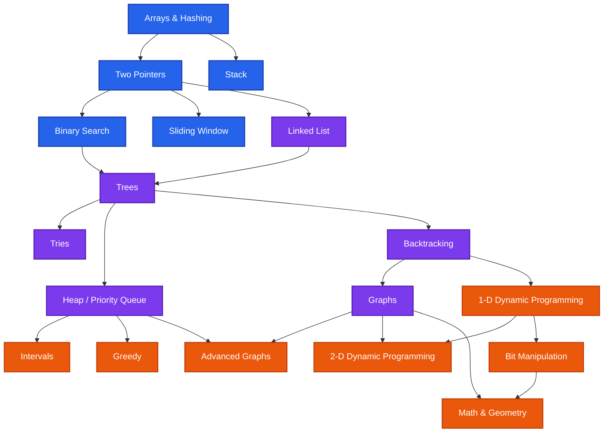

# Interview Prep Plan

My broad based interview preparation approach, based on the most important problems from the [Neetcode.io roadmap](https://neetcode.io/roadmap). I designed it so that I could focus on getting really good at 12 core patterns/algorithms, rather than trying to remember a bunch of problem solutions for only a few concepts. I believe this will enable me to solve other problems I haven't ecountered before. After establishing a strong understanding of these fundamentals, I will proceed into deeper understanding of more complex problems.

## Core problems to tackle first

1. **Arrays & Hashing**
   - [x] [Two Sum](/neetcode-roadmap/arrays-hashing/EASY-two-sum) (EASY)
   - [x] [Range Sum Query](/neetcode-roadmap/arrays-hashing/EASY-range-sum-query) (EASY)
   - [x] [Contains Duplicate](/neetcode-roadmap/arrays-hashing/EASY-contains-duplicate) (EASY)
   - [x] [Group Anagrams](/neetcode-roadmap/arrays-hashing/MEDIUM-group-anagrams) (MEDIUM)
   - [x] [Top K Frequent Elements](/neetcode-roadmap/arrays-hashing/MEDIUM-top-k-frequent-elements) (MEDIUM)

2. [**Two Pointers**](/neetcode-roadmap/two-pointers/)
   - [x] [Valid Palindrome](/neetcode-roadmap/two-pointers/EASY-valid-palindrome) (EASY)
   - [x] [Two Sum II](/neetcode-roadmap/two-pointers) (MEDIUM)
   - [ ] [3Sum](/neetcode-roadmap/two-pointers/MEDIUM-3sum) (MEDIUM)

3. [**Sliding Window**](/neetcode-roadmap/sliding-window)
   - [x] [Best Time to Buy and Sell Stock](/neetcode-roadmap/sliding-window/EASY-best-time-to-buy-and-sell-stock) (EASY)
   - [ ] [Longest Substring Without Repeating Characters](/neetcode-roadmap/sliding-window/MEDIUM-longest-substring-without-repeating-characters) (MEDIUM)

4. **Stack**
   - [x] [Valid Parentheses](/neetcode-roadmap/stack/EASY-valid-parentheses) (EASY)
   - [ ] [Daily Temperatures](/neetcode-roadmap/stack/MEDIUM-daily-temperatures) (MEDIUM)

5. **Binary Search**
   - [x] [Binary Search](/neetcode-roadmap/binary-search) (EASY)
   - [ ] [Search in Rotated Sorted Array](/neetcode-roadmap/binary-search/MEDIUM-search-in-rotated-sorted-array) (MEDIUM)

6. **Linked List**
   - [x] [Reverse Linked List](/neetcode-roadmap/linked-list/EASY-reverse-linked-list) (EASY)
   - [ ] [Merge Two Sorted Lists](/neetcode-roadmap/linked-list/EASY-merge-two-sorted-lists) (EASY)

7. **Trees**
   - [ ] [Maximum Depth of Binary Tree](/neetcode-roadmap/trees/EASY-maximum-depth-of-binary-tree) (EASY)
   - [ ] [Validate Binary Search Tree](/neetcode-roadmap/trees/MEDIUM-validate-binary-search-tree) (MEDIUM)

8. **Heap / Priority Queue**
   - [ ] [Kth Largest Element in an Array](/neetcode-roadmap/heap-priority-queue/MEDIUM-kth-largest-element-in-an-array) (MEDIUM)
   - [ ] [Find Median from Data Stream](/neetcode-roadmap/heap-priority-queue/HARD-find-median-from-data-stream) (HARD)

9. **Backtracking**
    - [ ] [Subsets](/neetcode-roadmap/backtracking/MEDIUM-subsets) (MEDIUM)
    - [ ] [Permutations](/neetcode-roadmap/backtracking/MEDIUM-permutations) (MEDIUM)

10. **Graphs**
    - [ ] [Number of Islands](/neetcode-roadmap/graphs/MEDIUM-number-of-islands) (MEDIUM)
    - [ ] [Course Schedule](/neetcode-roadmap/graphs/MEDIUM-course-schedule) (MEDIUM)

11. **1-D Dynamic Programming**
    - [ ] [Climbing Stairs](/neetcode-roadmap/1d-dynamic-programming/EASY-climbing-stairs) (EASY)
    - [ ] [House Robber](/neetcode-roadmap/1d-dynamic-programming/MEDIUM-house-robber) (MEDIUM)

12. **Greedy**
    - [x] [Maximum Subarray](/neetcode-roadmap/greedy/MEDIUM-maximum-subarray) (MEDIUM)
    - [ ] [Jump Game](/neetcode-roadmap/greedy/MEDIUM-jump-game) (MEDIUM)

## Full Neetcode Roadmap

## Arrays & Hashing

Foundation of problem-solving with arrays and hash-based data structures

- [x] [Contains Duplicate](/neetcode-roadmap/arrays-hashing/EASY-contains-duplicate)
- [ ] [Valid Anagram](/neetcode-roadmap/arrays-hashing/EASY-valid-anagram)
- [x] [Two Sum](/neetcode-roadmap/arrays-hashing/EASY-two-sum)
- [x] [Group Anagrams](/neetcode-roadmap/arrays-hashing/MEDIUM-group-anagrams)
- [x] [Top K Frequent Elements](/neetcode-roadmap/arrays-hashing/MEDIUM-top-k-frequent-elements)
- [ ] [Encode and Decode Strings](/neetcode-roadmap/arrays-hashing/MEDIUM-encode-and-decode-strings)
- [ ] [Product of Array Except Self](/neetcode-roadmap/arrays-hashing/MEDIUM-product-of-array-except-self)
- [ ] [Valid Sudoku](/neetcode-roadmap/arrays-hashing/MEDIUM-valid-sudoku)
- [ ] [Longest Consecutive Sequence](/neetcode-roadmap/arrays-hashing/MEDIUM-longest-consecutive-sequence)

## Two Pointers

Efficient traversal techniques using multiple pointers

- [x] [Valid Palindrome](/neetcode-roadmap/two-pointers/EASY-valid-palindrome)
- [x] [Two Sum II](/neetcode-roadmap/two-pointers)
- [ ] [3Sum](/neetcode-roadmap/two-pointers/MEDIUM-3sum)
- [ ] [Container With Most Water](/neetcode-roadmap/two-pointers/MEDIUM-container-with-most-water)
- [ ] [Trapping Rain Water](/neetcode-roadmap/two-pointers/HARD-trapping-rain-water)

## Sliding Window

Dynamic window techniques for substring and subarray problems

- [x] [Best Time to Buy and Sell Stock](/neetcode-roadmap/sliding-window/EASY-best-time-to-buy-and-sell-stock)
- [ ] [Longest Substring Without Repeating Characters](/neetcode-roadmap/sliding-window/MEDIUM-longest-substring-without-repeating-characters)
- [ ] [Longest Repeating Character Replacement](/neetcode-roadmap/sliding-window/MEDIUM-longest-repeating-character-replacement)
- [ ] [Permutation in String](/neetcode-roadmap/sliding-window/MEDIUM-permutation-in-string)
- [ ] [Minimum Window Substring](/neetcode-roadmap/sliding-window/HARD-minimum-window-substring)
- [ ] [Sliding Window Maximum](/neetcode-roadmap/sliding-window/HARD-sliding-window-maximum)

## Stack

LIFO data structure applications and monotonic stack patterns

- [x] [Valid Parentheses](/neetcode-roadmap/stack/EASY-valid-parentheses)
- [ ] [Min Stack](/neetcode-roadmap/stack/MEDIUM-min-stack)
- [ ] [Evaluate Reverse Polish Notation](/neetcode-roadmap/stack/MEDIUM-evaluate-reverse-polish-notation)
- [ ] [Generate Parentheses](/neetcode-roadmap/stack/MEDIUM-generate-parentheses)
- [ ] [Daily Temperatures](/neetcode-roadmap/stack/MEDIUM-daily-temperatures)
- [ ] [Car Fleet](/neetcode-roadmap/stack/MEDIUM-car-fleet)
- [ ] [Largest Rectangle in Histogram](/neetcode-roadmap/stack/HARD-largest-rectangle-in-histogram)

## Binary Search

Efficient search algorithms and their applications

- [x] [Binary Search](/neetcode-roadmap/binary-search)
- [ ] [Search a 2D Matrix](/neetcode-roadmap/binary-search/MEDIUM-search-a-2d-matrix)
- [ ] [Koko Eating Bananas](/neetcode-roadmap/binary-search/MEDIUM-koko-eating-bananas)
- [ ] [Find Minimum in Rotated Sorted Array](/neetcode-roadmap/binary-search/MEDIUM-find-minimum-in-rotated-sorted-array)
- [ ] [Search in Rotated Sorted Array](/neetcode-roadmap/binary-search/MEDIUM-search-in-rotated-sorted-array)
- [ ] [Time Based Key-Value Store](/neetcode-roadmap/binary-search/MEDIUM-time-based-key-value-store)
- [ ] [Median of Two Sorted Arrays](/neetcode-roadmap/binary-search/HARD-median-of-two-sorted-arrays)

## Linked List

Pointer manipulation and linked list operations

- [x] [Reverse Linked List](/neetcode-roadmap/linked-list/EASY-reverse-linked-list)
- [ ] [Merge Two Sorted Lists](/neetcode-roadmap/linked-list/EASY-merge-two-sorted-lists)
- [ ] [Reorder List](/neetcode-roadmap/linked-list/MEDIUM-reorder-list)
- [ ] [Remove Nth Node From End of List](/neetcode-roadmap/linked-list/MEDIUM-remove-nth-node-from-end-of-list)
- [ ] [Copy List with Random Pointer](/neetcode-roadmap/linked-list/MEDIUM-copy-list-with-random-pointer)
- [ ] [Add Two Numbers](/neetcode-roadmap/linked-list/MEDIUM-add-two-numbers)
- [ ] [Linked List Cycle](/neetcode-roadmap/linked-list/EASY-linked-list-cycle)
- [ ] [Find the Duplicate Number](/neetcode-roadmap/linked-list/MEDIUM-find-the-duplicate-number)
- [ ] [LRU Cache](/neetcode-roadmap/linked-list/MEDIUM-lru-cache)
- [ ] [Merge k Sorted Lists](/neetcode-roadmap/linked-list/HARD-merge-k-sorted-lists)
- [ ] [Reverse Nodes in k-Group](/neetcode-roadmap/linked-list/HARD-reverse-nodes-in-k-group)

## Trees

Binary trees, traversals, and tree-based algorithms

- [ ] [Invert Binary Tree](/neetcode-roadmap/trees/EASY-invert-binary-tree)
- [ ] [Maximum Depth of Binary Tree](/neetcode-roadmap/trees/EASY-maximum-depth-of-binary-tree)
- [ ] [Diameter of Binary Tree](/neetcode-roadmap/trees/EASY-diameter-of-binary-tree)
- [ ] [Balanced Binary Tree](/neetcode-roadmap/trees/EASY-balanced-binary-tree)
- [ ] [Same Tree](/neetcode-roadmap/trees/EASY-same-tree)
- [ ] [Subtree of Another Tree](/neetcode-roadmap/trees/EASY-subtree-of-another-tree)
- [ ] [Lowest Common Ancestor of a Binary Search Tree](/neetcode-roadmap/trees/MEDIUM-lowest-common-ancestor-of-a-binary-search-tree)
- [ ] [Binary Tree Level Order Traversal](/neetcode-roadmap/trees/MEDIUM-binary-tree-level-order-traversal)
- [ ] [Binary Tree Right Side View](/neetcode-roadmap/trees/MEDIUM-binary-tree-right-side-view)
- [ ] [Count Good Nodes in Binary Tree](/neetcode-roadmap/trees/MEDIUM-count-good-nodes-in-binary-tree)
- [ ] [Validate Binary Search Tree](/neetcode-roadmap/trees/MEDIUM-validate-binary-search-tree)
- [ ] [Kth Smallest Element in a BST](/neetcode-roadmap/trees/MEDIUM-kth-smallest-element-in-a-bst)
- [ ] [Construct Binary Tree from Preorder and Inorder Traversal](/neetcode-roadmap/trees/MEDIUM-construct-binary-tree-from-preorder-and-inorder-traversal)
- [ ] [Binary Tree Maximum Path Sum](/neetcode-roadmap/trees/HARD-binary-tree-maximum-path-sum)
- [ ] [Serialize and Deserialize Binary Tree](/neetcode-roadmap/trees/HARD-serialize-and-deserialize-binary-tree)

## Tries

Prefix trees for efficient string operations

- [ ] [Implement Trie (Prefix Tree)](/neetcode-roadmap/tries/MEDIUM-implement-trie-prefix-tree)
- [ ] [Design Add and Search Words Data Structure](/neetcode-roadmap/tries/MEDIUM-design-add-and-search-words-data-structure)
- [ ] [Word Search II](/neetcode-roadmap/tries/HARD-word-search-ii)

## Heap / Priority Queue

Heap data structure and priority-based algorithms

- [ ] [Kth Largest Element in a Stream](/neetcode-roadmap/heap-priority-queue/EASY-kth-largest-element-in-a-stream)
- [ ] [Last Stone Weight](/neetcode-roadmap/heap-priority-queue/EASY-last-stone-weight)
- [ ] [K Closest Points to Origin](/neetcode-roadmap/heap-priority-queue/MEDIUM-k-closest-points-to-origin)
- [ ] [Kth Largest Element in an Array](/neetcode-roadmap/heap-priority-queue/MEDIUM-kth-largest-element-in-an-array)
- [ ] [Task Scheduler](/neetcode-roadmap/heap-priority-queue/MEDIUM-task-scheduler)
- [ ] [Design Twitter](/neetcode-roadmap/heap-priority-queue/MEDIUM-design-twitter)
- [ ] [Find Median from Data Stream](/neetcode-roadmap/heap-priority-queue/HARD-find-median-from-data-stream)

## Backtracking

Systematic exploration of solution spaces

- [ ] [Subsets](/neetcode-roadmap/backtracking/MEDIUM-subsets)
- [ ] [Combination Sum](/neetcode-roadmap/backtracking/MEDIUM-combination-sum)
- [ ] [Permutations](/neetcode-roadmap/backtracking/MEDIUM-permutations)
- [ ] [Subsets II](/neetcode-roadmap/backtracking/MEDIUM-subsets-ii)
- [ ] [Combination Sum II](/neetcode-roadmap/backtracking/MEDIUM-combination-sum-ii)
- [ ] [Word Search](/neetcode-roadmap/backtracking/MEDIUM-word-search)
- [ ] [Palindrome Partitioning](/neetcode-roadmap/backtracking/MEDIUM-palindrome-partitioning)
- [ ] [Letter Combinations of a Phone Number](/neetcode-roadmap/backtracking/MEDIUM-letter-combinations-of-a-phone-number)
- [ ] [N-Queens](/neetcode-roadmap/backtracking/HARD-n-queens)

## Graphs

Graph representation, traversal, and algorithms

- [ ] [Number of Islands](/neetcode-roadmap/graphs/MEDIUM-number-of-islands)
- [ ] [Clone Graph](/neetcode-roadmap/graphs/MEDIUM-clone-graph)
- [ ] [Max Area of Island](/neetcode-roadmap/graphs/MEDIUM-max-area-of-island)
- [ ] [Pacific Atlantic Water Flow](/neetcode-roadmap/graphs/MEDIUM-pacific-atlantic-water-flow)
- [ ] [Surrounded Regions](/neetcode-roadmap/graphs/MEDIUM-surrounded-regions)
- [ ] [Rotting Oranges](/neetcode-roadmap/graphs/MEDIUM-rotting-oranges)
- [ ] [Walls and Gates](/neetcode-roadmap/graphs/MEDIUM-walls-and-gates)
- [ ] [Course Schedule](/neetcode-roadmap/graphs/MEDIUM-course-schedule)
- [ ] [Course Schedule II](/neetcode-roadmap/graphs/MEDIUM-course-schedule-ii)
- [ ] [Redundant Connection](/neetcode-roadmap/graphs/MEDIUM-redundant-connection)
- [ ] [Number of Connected Components in an Undirected Graph](/neetcode-roadmap/graphs/MEDIUM-number-of-connected-components-in-an-undirected-graph)
- [ ] [Graph Valid Tree](/neetcode-roadmap/graphs/MEDIUM-graph-valid-tree)
- [ ] [Word Ladder](/neetcode-roadmap/graphs/HARD-word-ladder)

## Advanced Graphs

Advanced graph algorithms and techniques

- [ ] [Reconstruct Itinerary](/neetcode-roadmap/advanced-graphs/HARD-reconstruct-itinerary)
- [ ] [Min Cost to Connect All Points](/neetcode-roadmap/advanced-graphs/MEDIUM-min-cost-to-connect-all-points)
- [ ] [Network Delay Time](/neetcode-roadmap/advanced-graphs/MEDIUM-network-delay-time)
- [ ] [Swim in Rising Water](/neetcode-roadmap/advanced-graphs/HARD-swim-in-rising-water)
- [ ] [Alien Dictionary](/neetcode-roadmap/advanced-graphs/HARD-alien-dictionary)
- [ ] [Cheapest Flights Within K Stops](/neetcode-roadmap/advanced-graphs/MEDIUM-cheapest-flights-within-k-stops)

## 1-D Dynamic Programming

One-dimensional dynamic programming patterns

- [ ] [Climbing Stairs](/neetcode-roadmap/1d-dynamic-programming/EASY-climbing-stairs)
- [ ] [Min Cost Climbing Stairs](/neetcode-roadmap/1d-dynamic-programming/EASY-min-cost-climbing-stairs)
- [ ] [House Robber](/neetcode-roadmap/1d-dynamic-programming/MEDIUM-house-robber)
- [ ] [House Robber II](/neetcode-roadmap/1d-dynamic-programming/MEDIUM-house-robber-ii)
- [ ] [Longest Palindromic Substring](/neetcode-roadmap/1d-dynamic-programming/MEDIUM-longest-palindromic-substring)
- [ ] [Palindromic Substrings](/neetcode-roadmap/1d-dynamic-programming/MEDIUM-palindromic-substrings)
- [ ] [Decode Ways](/neetcode-roadmap/1d-dynamic-programming/MEDIUM-decode-ways)
- [ ] [Coin Change](/neetcode-roadmap/1d-dynamic-programming/MEDIUM-coin-change)
- [ ] [Maximum Product Subarray](/neetcode-roadmap/1d-dynamic-programming/MEDIUM-maximum-product-subarray)
- [ ] [Word Break](/neetcode-roadmap/1d-dynamic-programming/MEDIUM-word-break)
- [ ] [Longest Increasing Subsequence](/neetcode-roadmap/1d-dynamic-programming/MEDIUM-longest-increasing-subsequence)
- [ ] [Partition Equal Subset Sum](/neetcode-roadmap/1d-dynamic-programming/MEDIUM-partition-equal-subset-sum)

## 2-D Dynamic Programming

Two-dimensional dynamic programming patterns

- [ ] [Unique Paths](/neetcode-roadmap/2d-dynamic-programming/MEDIUM-unique-paths)
- [ ] [Longest Common Subsequence](/neetcode-roadmap/2d-dynamic-programming/MEDIUM-longest-common-subsequence)
- [ ] [Best Time to Buy and Sell Stock with Cooldown](/neetcode-roadmap/2d-dynamic-programming/MEDIUM-best-time-to-buy-and-sell-stock-with-cooldown)
- [ ] [Coin Change 2](/neetcode-roadmap/2d-dynamic-programming/MEDIUM-coin-change-2)
- [ ] [Target Sum](/neetcode-roadmap/2d-dynamic-programming/MEDIUM-target-sum)
- [ ] [Interleaving String](/neetcode-roadmap/2d-dynamic-programming/MEDIUM-interleaving-string)
- [ ] [Longest Increasing Path in a Matrix](/neetcode-roadmap/2d-dynamic-programming/HARD-longest-increasing-path-in-a-matrix)
- [ ] [Distinct Subsequences](/neetcode-roadmap/2d-dynamic-programming/HARD-distinct-subsequences)
- [ ] [Edit Distance](/neetcode-roadmap/2d-dynamic-programming/HARD-edit-distance)
- [ ] [Burst Balloons](/neetcode-roadmap/2d-dynamic-programming/HARD-burst-balloons)
- [ ] [Regular Expression Matching](/neetcode-roadmap/2d-dynamic-programming/HARD-regular-expression-matching)

## Greedy

Greedy algorithm patterns and optimization problems

- [x] [Maximum Subarray](/neetcode-roadmap/greedy/MEDIUM-maximum-subarray)
- [ ] [Jump Game](/neetcode-roadmap/greedy/MEDIUM-jump-game)
- [ ] [Jump Game II](/neetcode-roadmap/greedy/MEDIUM-jump-game-ii)
- [ ] [Gas Station](/neetcode-roadmap/greedy/MEDIUM-gas-station)
- [ ] [Hand of Straights](/neetcode-roadmap/greedy/MEDIUM-hand-of-straights)
- [ ] [Merge Triplets to Form Target Triplet](/neetcode-roadmap/greedy/MEDIUM-merge-triplets-to-form-target-triplet)
- [ ] [Partition Labels](/neetcode-roadmap/greedy/MEDIUM-partition-labels)
- [ ] [Valid Parenthesis String](/neetcode-roadmap/greedy/MEDIUM-valid-parenthesis-string)

## Intervals

Interval-based problems and scheduling algorithms

- [ ] [Insert Interval](/neetcode-roadmap/intervals/MEDIUM-insert-interval)
- [ ] [Merge Intervals](/neetcode-roadmap/intervals/MEDIUM-merge-intervals)
- [ ] [Non-overlapping Intervals](/neetcode-roadmap/intervals/MEDIUM-non-overlapping-intervals)
- [ ] [Meeting Rooms](/neetcode-roadmap/intervals/EASY-meeting-rooms)
- [ ] [Meeting Rooms II](/neetcode-roadmap/intervals/MEDIUM-meeting-rooms-ii)
- [ ] [Minimum Interval to Include Each Query](/neetcode-roadmap/intervals/HARD-minimum-interval-to-include-each-query)

## Math & Geometry

Mathematical algorithms and geometric problems

- [ ] [Rotate Image](/neetcode-roadmap/math-geometry/MEDIUM-rotate-image)
- [ ] [Spiral Matrix](/neetcode-roadmap/math-geometry/MEDIUM-spiral-matrix)
- [ ] [Set Matrix Zeroes](/neetcode-roadmap/math-geometry/MEDIUM-set-matrix-zeroes)
- [ ] [Happy Number](/neetcode-roadmap/math-geometry/EASY-happy-number)
- [ ] [Plus One](/neetcode-roadmap/math-geometry/EASY-plus-one)
- [ ] [Pow(x, n)](/neetcode-roadmap/math-geometry/MEDIUM-powx-n)
- [ ] [Multiply Strings](/neetcode-roadmap/math-geometry/MEDIUM-multiply-strings)
- [ ] [Detect Squares](/neetcode-roadmap/math-geometry/MEDIUM-detect-squares)

## Bit Manipulation

Bitwise operations and their algorithmic applications

- [ ] [Single Number](/neetcode-roadmap/bit-manipulation/EASY-single-number)
- [ ] [Number of 1 Bits](/neetcode-roadmap/bit-manipulation/EASY-number-of-1-bits)
- [ ] [Counting Bits](/neetcode-roadmap/bit-manipulation/EASY-counting-bits)
- [ ] [Reverse Bits](/neetcode-roadmap/bit-manipulation/EASY-reverse-bits)
- [ ] [Missing Number](/neetcode-roadmap/bit-manipulation/EASY-missing-number)
- [ ] [Sum of Two Integers](/neetcode-roadmap/bit-manipulation/MEDIUM-sum-of-two-integers)
- [ ] [Reverse Integer](/neetcode-roadmap/bit-manipulation/MEDIUM-reverse-integer)

## Resources

Key resources I'm using in my preparation:

- [Neetcode.io](https://neetcode.io/)
- LeetCode
- "Cracking the Coding Interview" by Gayle Laakmann McDowell